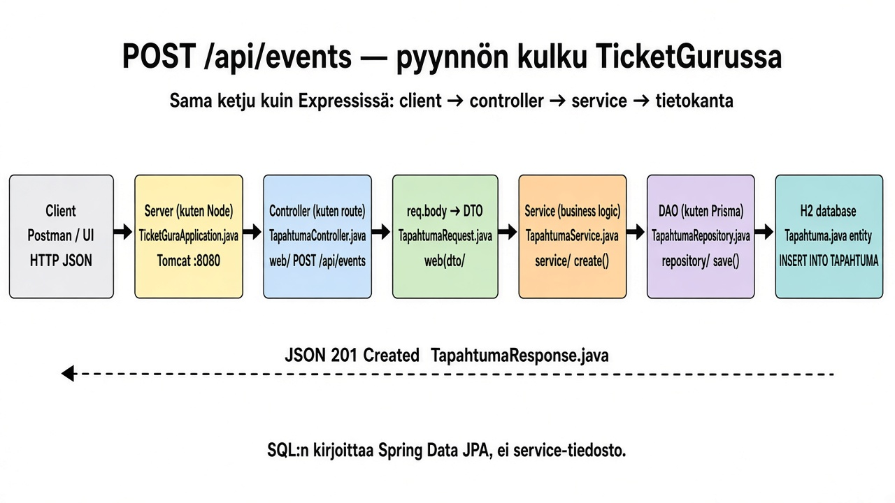
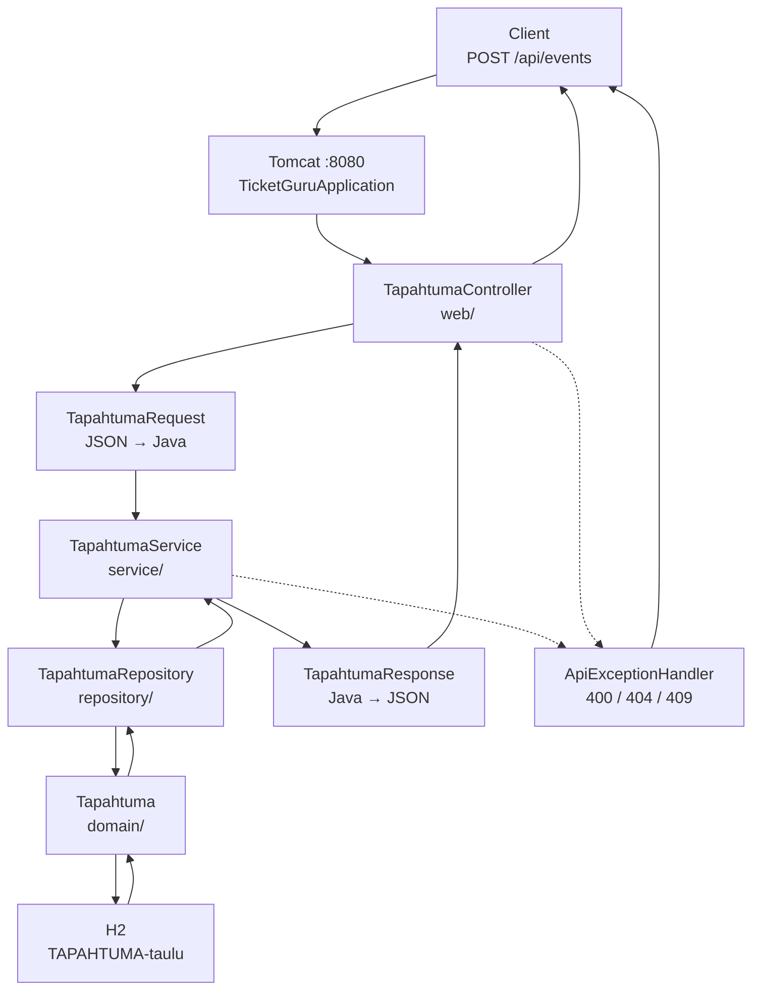

# Miten pyyntö kulkee Spring Bootissa (tapahtuma)

`docs/api/events.md` on **API-sopimus** (URL:t, JSON, paluukoodit). Tämä tiedosto on **kuva ketjusta**: sama kuin Expressissä `route → controller → service → db`, mutta Spring-tiedostot.

## Kuva: POST /api/events



Polku repossa (vasemmalta oikealle):

```text
Postman / client
  → TicketGuruApplication.java          (server.js — Tomcat :8080)
  → web/TapahtumaController.java        (router.post("/api/events", …))
  → web/dto/TapahtumaRequest.java       (req.body, validoitu)
  → service/TapahtumaService.java       (create — säännöt, ei SQL:ää)
  → repository/TapahtumaRepository.java (prisma.tapahtuma.create)
  → domain/Tapahtuma.java + H2          (taulu TAPAHTUMA, INSERT)
  ← web/dto/TapahtumaResponse.java      (res.status(201).json(…))
```

Kansio: `backend/src/main/java/fi/haagahelia/ticketguru/`.

Client-API: [api/events.md](api/events.md).

---

## 1. Vertailu JavaScriptiin

| JS (Express / Deno) | TicketGuru (Spring Boot) | Tiedosto |
| --- | --- | --- |
| `node server.js` / Deno | upotettu Tomcat, portti 8080 | `TicketGuruApplication.java` + `application.properties` |
| `app.get("/api/events", …)` | `@RestController` + `@GetMapping` | `web/TapahtumaController.java` |
| `req.params`, `req.query`, `req.body` | `@PathVariable`, `@RequestParam`, `@RequestBody` | sama controller |
| `res.json(…)`, `res.status(201)` | paluuarvo / `ResponseEntity` | sama controller |
| Zod / käsin validoitu body | `@Valid` + `TapahtumaRequest` | `web/dto/TapahtumaRequest.java` |
| service-funktio | `@Service` | `service/TapahtumaService.java` |
| Prisma / Knex / oma DAO | `interface … extends JpaRepository` | `repository/TapahtumaRepository.java` |
| taulun rivi olioksi | `@Entity` | `domain/Tapahtuma.java` |
| error middleware | `@RestControllerAdvice` | `web/ApiExceptionHandler.java` |
| SQLite :memory: | H2 muistissa | `jdbc:h2:mem:ticketguru` |

Kerrokset:

```text
Client (selain, Postman, toisen firman UI)
        │  HTTP JSON
        ▼
Controller   ← HTTP: polku, metodi, JSON ↔ Java-oliot
        │
        ▼
Service      ← säännöt (404, 409, kartoitus DTO ↔ entity)
        │
        ▼
Repository   ← “hae / tallenna”; Spring kirjoittaa SQL:n
        │
        ▼
Hibernate + H2   ← taulu TAPAHTUMA
```

Controller ei avaa JDBC-yhteyttä. Service ei tunne HTTP-otsakkeita (paitsi heittäessään `ResponseStatusException`). Repository on rajapinta ilman `class`-toteutusta — Spring täyttää metodit käynnistyessä, kuten luento-ohjeessa.

---

## 2. Arkkitehtuuri (tapahtuma)



Pakkaukset `backend/src/main/java/fi/haagahelia/ticketguru/`:

| Paketti | Rooli JS-kielellä |
| --- | --- |
| `web/` | reitit + HTTP |
| `web/dto/` | `req.body` / `res.json` -muoto, ei Hibernate-kokoelmia |
| `service/` | business logic |
| `repository/` | DAO |
| `domain/` | taulun olio |

---

## 3. Esimerkki: client luo tapahtuman

Pyyntö:

```http
POST http://localhost:8080/api/events
Content-Type: application/json

{
  "nimi": "Tapahtuma C",
  "aika": "2026-12-01T18:00:00",
  "kaupunki": "Espoo",
  "paikka": "Sellosali",
  "lippujaKpl": 80
}
```

### 3.1 Sisääntulo — ei omaa `server.js`-reititintä

`TicketGuruApplication` käynnistää kontin. Tomcat kuuntelee 8080. Spring skannaa `@RestController`-luokat.

`TapahtumaController` on merkitty `@RequestMapping("/api/events")` ja `create` `@PostMapping`. Spring yhdistää **POST + `/api/events`** tähän metodiin. Sama idea kuin `router.post("/api/events", createEvent)`.

### 3.2 Controller — HTTP-reuna

Tiedosto: `backend/src/main/java/fi/haagahelia/ticketguru/web/TapahtumaController.java`

1. Jackson muuttaa JSON:n `TapahtumaRequest`-recordiksi (`@RequestBody`).
2. `@Valid` tarkistaa `@NotBlank`, `@NotNull`, `@Min(1)`. Epäkelpo → `ApiExceptionHandler` → **400**, serviceen ei mennä.
3. `tapahtumaService.create(request)` — controller ei tiedä H2:sta.
4. Paluu: **201**, otsake `Location: /api/events/{id}`, runko `TapahtumaResponse`.

JS-analogia: `const body = req.body; const created = await eventService.create(body); res.status(201).json(created);`

### 3.3 Service — säännöt, ei SQL:ää

Tiedosto: `backend/src/main/java/fi/haagahelia/ticketguru/service/TapahtumaService.java`

`create`:

1. `request.toEntity()` → `Tapahtuma`-olio (ei vielä kannassa).
2. `tapahtumaRepository.save(…)` → INSERT.
3. Hibernate täyttää `id`:n.
4. `TapahtumaResponse.from(tallennettu)` → JSON-ystävällinen record (ei `lipputyypit`-listaa).

`@Transactional`: koko metodi yksi tietokantatransaktio. Poistossa service estää DELETE:n, jos lipputyyppejä tai myyntejä on (**409**).

### 3.4 Repository — DAO, jonka Spring toteuttaa

Tiedosto: `backend/src/main/java/fi/haagahelia/ticketguru/repository/TapahtumaRepository.java`

```java
public interface TapahtumaRepository extends JpaRepository<Tapahtuma, Long> { … }
```

`save`, `findById`, `delete` tulevat `JpaRepository`sta. Itse nimetyt metodit (`findByKaupunkiIgnoreCaseOrderByAikaAsc`) kääntyvät SQL:ksi nimen perusteella. **Ei `TapahtumaRepositoryImpl.java`-tiedostoa.**

JS-analogia: `prisma.tapahtuma.create({ data })` — kutsu on omassa koodissa, SQL frameworkin.

### 3.5 Entity → H2

Tiedosto: `backend/src/main/java/fi/haagahelia/ticketguru/domain/Tapahtuma.java`

`@Entity` = taulu. Hibernate tekee (lokissa `show-sql=true`):

```sql
insert into tapahtuma (aika, kaupunki, lippuja_kpl, nimi, paikka, id)
values (?, ?, ?, ?, ?, ?)
```

Kanta: `jdbc:h2:mem:ticketguru`. Rivi katoaa, kun prosessi sammuu.

### 3.6 Paluu clientille

```
H2
 → Tapahtuma (id täytetty)
 → TapahtumaResponse
 → Jackson JSON
 → HTTP 201 + Location
 → client
```

Esimerkki:

```json
{
  "id": 3,
  "nimi": "Tapahtuma C",
  "aika": "2026-12-01T18:00:00",
  "kaupunki": "Espoo",
  "paikka": "Sellosali",
  "lippujaKpl": 80
}
```

---

## 4. Sama ketju muissa verbeissä

Kaikki tulevat **samaan controlleriin**. Metodi + polku valitsee funktion.

| Client | Controller-metodi | Service | Kanta |
| --- | --- | --- | --- |
| `GET /api/events` | `list` | `findAll` | `SELECT` (kaikki tai `kaupunki`) |
| `GET /api/events/1` | `get` | `findById` | `SELECT` PK:lla; ei riviä → 404 |
| `PUT /api/events/1` | `update` | `update` | `SELECT` + `UPDATE` |
| `DELETE /api/events/3` | `delete` | `delete` | tarkistus lapsista, sitten `DELETE` |

`GET /api/events?kaupunki=Helsinki`: query-parametri `kaupunki` menee `list(String kaupunki)`-argumentiksi, aivan kuten `req.query.kaupunki`.

---

## 5. Mitä Spring tekee puolestasi (ja mitä ei)

| Automaattista käynnistyessä | Sinun koodisi |
| --- | --- |
| HTTP-palvelin, reitin kytkentä annotaatioista | controller, service, entity, repository-*interface* |
| JSON ↔ Java | DTO-kenttien nimet (`nimi`, `lippujaKpl`) |
| SQL `save`/`findBy…` | metodin nimeäminen repositoryssä |
| `CREATE TABLE` Entityistä (`ddl-auto=update`) | taulun suunnittelu Entity-kenttinä |

Ei ole `app.get` + `switch (url)`-tiedostoa. Reitti *on* annotoitu metodi.

---

## 6. Virheet (Expressin error middleware)

Tiedosto: `web/ApiExceptionHandler.java`

| Tilanne | Missä syntyy | HTTP |
| --- | --- | --- |
| Tyhjä `nimi` | `@Valid` controllerissa | 400 |
| Rikkinäinen JSON | Jackson ennen controlleria | 400 |
| Tuntematon id | service `requireTapahtuma` | 404 |
| Poisto vaikka myyntejä on | service `delete` | 409 |

Client saa aina JSON-rungon `{ status, error, messages }`, ei HTML-stack tracea.

---

## 7. Miten seurata itse

1. `cd backend && ./mvnw spring-boot:run`
2. POST (yllä).
3. Konsoliloki: `insert into tapahtuma …` (`spring.jpa.show-sql=true`).
4. H2: http://localhost:8080/h2-console · `jdbc:h2:mem:ticketguru` · `SELECT * FROM TAPAHTUMA;`

Seuraava lukemisen järjestys koodissa: **Controller → Service → Repository → Entity**.
