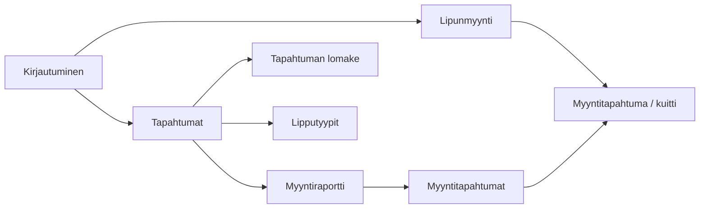
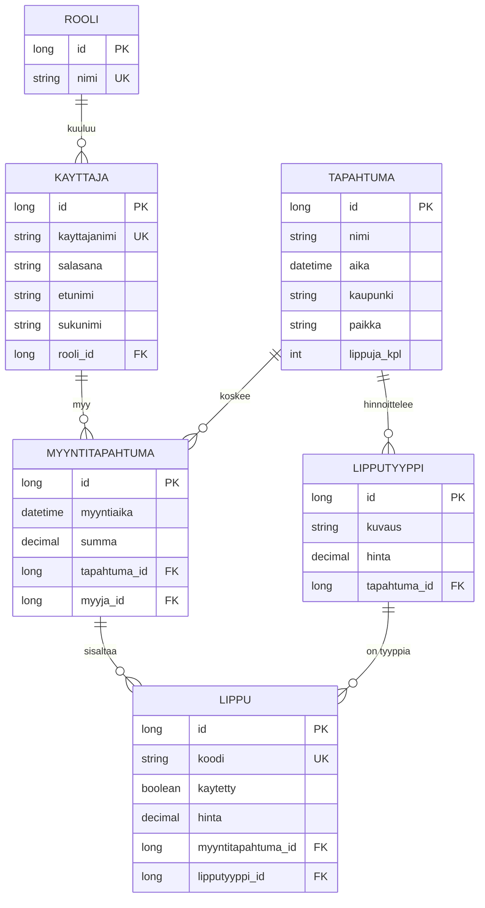

# TicketGuru-dokumentaatio

Haaga-Helia Ohjelmistoprojekti 1 · Sprint 2

Tämä dokumentti sisältää luvut **Johdanto**, **Järjestelmän määrittely**, **Käyttöliittymä** ja **Tietokanta**. Lukuja täydennetään sprinteittäin, kun toteutus etenee.

---

## 1. Johdanto

### 1.0 Tilaajan kuvaus (ennen sprinttiä 1)

Tuoteomistajan terveiset. **Asiakas** tarkoittaa tässä ensin **lipputoimistoa**, joka on tilannut järjestelmän — ei kassalla seisovaa ostajaa.

> Asiakkaamme on lipputoimisto, joka on tilannut lipunmyyntijärjestelmän lippujen myymiseen myyntipisteessään. Toimisto voi määritellä järjestelmään tapahtumat, joihin lippuja myydään. Järjestelmän alustava nimi on TicketGuru.
>
> Lipunmyyntipisteessä lipunmyyjä myy ja tulostaa asiakkaalle liput. Ennakkomyynnin loputtua loput liput tulostetaan ovella myytäviksi. Lipuissa on ovella helposti tarkastettava koodi, jolla lippu voidaan ovella merkitä käytetyksi.
>
> Jatkokehityksessä järjestelmään aiotaan lisätä verkkokauppa, jolla asiakkaat voivat itse ostaa lippuja.
>
> Asiakkaan veljenpoika opiskelee Haaga-Helia ammattikorkeakoulussa tietojenkäsittelyä, ja asiakas on pyytänyt poikaa laatimaan järjestelmän tärkeimmistä käyttöliittymistä alustavat wireframe-mallit. Saamme ne käyttöömme, mutta niitä kannattaa pitää vain suuntaa-antavina. Niistä kuitenkin saa selville monia asioita siitä, miten tilaaja on ajatellut järjestelmää käytettävän ja mitä siltä odotetaan.

Wireframet: `docs/ui/TicketGuru-UI.pdf` (suuntaa-antavat).

Samassa tekstissä sana **asiakas** esiintyy kolmessa merkityksessä. Ne eivät ole sama tietokantataulu.

| Tekstissä | Kuka | Järjestelmässä |
| --- | --- | --- |
| “Asiakkaamme on lipputoimisto” | Tilaaja (software-projektin asiakas) | ei taulu |
| “tulostaa asiakkaalle liput” | Kassalla ostava henkilö | ei taulua tässä versiossa; myynti + lipun koodi riittävät |
| “verkkokauppa, jolla asiakkaat voivat itse ostaa” | Tuleva itsepalveluostaja | myöhemmin käyttäjärooli / mahdollinen `Asiakas`-taulu |

Kuitti-luonnoksessa ei ole ostajan nimeä, sähköpostia eikä asiakashakua. Rivit ovat: tapahtuma, lipputyyppi, hinta, koodi, myyntinumero, maksettu-aika, summa.

TicketGuru on **myyntipisteen lipunmyyntijärjestelmä**. Ostaja ei käytä järjestelmää: myyjä myy ja tulostaa liput kassalla.

Järjestelmän avulla lipputoimisto voi

- hallita tapahtumia (nimi, aika, paikka, kaupunki, lippujen enimmäismäärä)
- määritellä tapahtumakohtaiset lipputyypit ja hinnat (esim. aikuinen, lapsi, eläkeläinen)
- myydä yhden tai useamman lipun samassa myyntitapahtumassa
- tulostaa myydyt liput, joista jokaisella on yksilöllinen koodi; ovella koodilla lippu merkitään käytetyksi
- tulostaa ennakkomyynnin jälkeen jäljellä olevat liput ovimyyntiä varten
- tarkastella tapahtuman myyntiraporttia ja yksittäisiä myyntitapahtumia

Tämän kurssin aikana rakennetaan myyntipisteen ydin: Spring Boot -backend, tietokanta ja käyttöliittymä. Verkkokauppa on rajattu pois.

### 1.1 Tavoite ja rajaus

**Tavoite:** toimiva lipunmyyntijärjestelmä, jolla myyjä voi myydä lippuja ja tapahtumakoordinaattori voi ylläpitää tapahtumia, lipputyyppejä ja seurata myyntiä.

**Rajaus (tämä kurssi):**

- Ei ostajan itsepalveluostosta (verkkokauppa on jatkokehitys tilaajan tekstissä).
- Ei ostajarekisteriä (nimi, sähköposti, tili). Tilaajan “asiakas” kassalla saa tulostetun lipun; häntä ei tallenneta tauluun.
- Ei maksuliikennettä pankki- tai korttiterminaaliin; myynti kuitataan maksetuksi järjestelmässä.
- Paikkakarttaa tai istumapaikkakohtaista varausta ei toteuteta; liput ovat tyyppi- ja tapahtumakohtaisia.

### 1.2 Tekninen lähtökohta

| Osa | Valinta Sprint 2:ssa |
| --- | --- |
| Backend | Java 25 (LTS), Spring Boot 4.1, REST (toistaiseksi `/api/health`) |
| Persistenssi | JPA/Hibernate, entityt ja repositoryt |
| Tietokanta kehityksessä | H2 (muistissa) + esimerkkidata |
| Tietokanta myöhemmin | PostgreSQL tai MariaDB (päätetään tiimissä) |
| Käyttöliittymä | Alustavat näkymät dokumentoitu; toteutus myöhemmässä sprintissä |
| Versionhallinta | Git + GitHub |
| Prosessi | Scrum, yhden viikon sprintit |

Lähdekoodi ja tämä dokumentaatio ovat samassa GitHub-repositoriossa.

---

## 2. Järjestelmän määrittely

Määrittely perustuu asiakkaan käyttöliittymäluonnoksiin (`docs/ui/TicketGuru-UI.pdf`) sekä lipunmyyntipisteen tyypilliseen työnkulkuun.

### 2.1 Käyttäjäroolit

**Käyttäjärooli** = kuka kirjautuu ja käyttää TicketGurua.  
Tilaajan tekstissä “asiakas” tarkoittaa yleensä **lipputoimistoa**. Kassalla ostava henkilö on eri asia, eikä hän ole käyttäjärooli eikä taulu.

#### Ostaja kassalla — ei käyttäjä, ei taulu

Myyjä “myy ja tulostaa asiakkaalle liput”. Ostaja ei kirjaudu. Wireframessa ei ole ostajan nimeä eikä hakua.

`Asiakas`-taulu tulisi mukaan vasta verkkokaupassa (“asiakkaat voivat itse ostaa lippuja”). Silloin ostaja on järjestelmän käyttäjä.

#### Myyjä (lipunmyyjä)

Toimii kassalla asiakasrajapinnassa.

- Kirjautuu järjestelmään.
- Näkee myynnissä olevat tapahtumat.
- Valitsee tapahtuman, lipputyypit ja kappalemäärät.
- Luo myyntitapahtuman, merkitsee sen maksetuksi ja tulostaa liput.
- Voi tulostaa ennakkomyynnin jälkeen jäljellä olevat liput ovimyyntiä varten (myöhempi tarkennus).

#### Tapahtumakoordinaattori

Ylläpitää myytävää tarjontaa ja seuraa myyntiä.

- Kirjautuu järjestelmään.
- Lisää, muokkaa ja tarvittaessa peruu tapahtumia.
- Määrittelee lipputyypit ja hinnat.
- Tarkastelee myyntiraporttia (kpl ja eurot lipputyypeittäin).
- Selaa yksittäisiä myyntitapahtumia ja avaa niiden sisällön.

#### Pääkäyttäjä

Hallinnoi järjestelmän käyttäjiä ja rooleja (toteutus myöhemmin, kun kirjautuminen otetaan käyttöön).

| Rooli | Tapahtumat | Lipputyypit | Lipunmyynti | Raportit | Käyttäjät |
| --- | --- | --- | --- | --- | --- |
| Myyjä | katselu | katselu | kyllä | ei | ei |
| Tapahtumakoordinaattori | CRUD | CRUD | tarvittaessa | kyllä | ei |
| Pääkäyttäjä | kyllä | kyllä | kyllä | kyllä | kyllä |

Oikeudet tarkennetaan, kun Spring Security lisätään. Sprint 1:ssä backend on vielä avoin paikallinen REST-palvelin.

### 2.2 Käyttäjätarinat

Muoto: *Roolina haluan [toiminnon], jotta [hyöty].*  
Tunnisteet vastaavat GitHub-issuen otsikoita tuotteen työjonossa.

#### Myyjä (M)

| ID | Käyttäjätarina | Prioriteetti |
| --- | --- | --- |
| M1 | Myyjänä haluan kirjautua sisään, jotta vain valtuutetut henkilöt voivat myydä lippuja. | Korkea |
| M2 | Myyjänä haluan nähdä tulevat tapahtumat aikoineen, jotta voin tarjota asiakkaalle oikeaa tapahtumaa. | Korkea |
| M3 | Myyjänä haluan nähdä tapahtuman lipputyypit ja hinnat, jotta veloitan asiakasta oikein. | Korkea |
| M4 | Myyjänä haluan valita yhteen myyntiin useita lippuja (eri tyyppejä), jotta asiakas voi ostaa kerralla esim. kaksi aikuista ja yhden lapsen. | Korkea |
| M5 | Myyjänä haluan nähdä myynnin summan ennen vahvistusta, jotta voin kertoa hinnan asiakkaalle. | Korkea |
| M6 | Myyjänä haluan vahvistaa myynnin maksetuksi, jotta liput kirjautuvat myydyiksi. | Korkea |
| M7 | Myyjänä haluan, että jokainen lippu saa yksilöllisen koodin, jotta lippu voidaan tarkastaa ovella ja merkitä käytetyksi. | Korkea |
| M8 | Myyjänä haluan tulostaa myydyt liput, jotta voin antaa ne ostajalle. | Korkea |
| M9 | Myyjänä haluan nähdä, paljonko lippuja on vielä jäljellä, jotta en myy yli kapasiteetin. | Korkea |
| M10 | Myyjänä haluan avata aiemman myyntitapahtuman numerolla, jotta voin tulostaa liput uudelleen. | Keskitaso |
| M11 | Myyjänä haluan ennakkomyynnin päätyttyä tulostaa jäljellä olevat liput, jotta niitä voidaan myydä ovella. | Keskitaso |

#### Tapahtumakoordinaattori (TK)

| ID | Käyttäjätarina | Prioriteetti |
| --- | --- | --- |
| TK1 | Tapahtumakoordinaattorina haluan kirjautua sisään, jotta voin ylläpitää tapahtumia. | Korkea |
| TK2 | Tapahtumakoordinaattorina haluan lisätä tapahtuman (nimi, aika, kaupunki, paikka, lippujen kpl), jotta se tulee myyntiin. | Korkea |
| TK3 | Tapahtumakoordinaattorina haluan muokata tapahtuman tietoja, jotta tiedot pysyvät ajan tasalla. | Korkea |
| TK4 | Tapahtumakoordinaattorina haluan listata tapahtumat, jotta näen koko tarjonnan. | Korkea |
| TK5 | Tapahtumakoordinaattorina haluan lisätä lipputyypin kuvauksen ja hinnan, jotta myyjä voi myydä eri asiakasryhmiä. | Korkea |
| TK6 | Tapahtumakoordinaattorina haluan muokata lipputyypin hintaa, jotta hinnoittelu voidaan päivittää. | Korkea |
| TK7 | Tapahtumakoordinaattorina haluan nähdä myyntiraportin lipputyypeittäin (kpl ja eurot), jotta seuraan myynnin etenemistä. | Korkea |
| TK8 | Tapahtumakoordinaattorina haluan listata tapahtuman myyntitapahtumat, jotta voin tarkistaa yksittäiset kaupat. | Keskitaso |
| TK9 | Tapahtumakoordinaattorina haluan avata myyntitapahtuman tiedot, jotta näen mitä lippuja siihen kuuluu. | Keskitaso |
| TK10 | Tapahtumakoordinaattorina haluan perua tapahtuman, jotta myynti voidaan keskeyttää esim. esiintyjän peruttua. | Matala |

#### Pääkäyttäjä (P) ja järjestelmä (J)

| ID | Käyttäjätarina | Prioriteetti |
| --- | --- | --- |
| P1 | Pääkäyttäjänä haluan luoda käyttäjätilejä ja liittää niihin roolin, jotta myyjät ja koordinaattorit pääsevät järjestelmään. | Keskitaso |
| J1 | Järjestelmänä en salli myyntiä, jos tapahtuman kapasiteetti ylittyisi, jotta ylipaikkoja ei synny. | Korkea |
| J2 | Järjestelmänä tallennan myyntitapahtumalle ajan, tunnisteen ja summan, jotta raportointi on luotettavaa. | Korkea |
| J3 | Järjestelmänä voin merkitä lipun käytetyksi koodilla, jotta samaa lippua ei käytetä ovella kahdesti. | Korkea |

### 2.3 Keskeiset käsitteet

| Käsite | Kuvaus |
| --- | --- |
| Tapahtuma | Tilaisuus, johon myydään lippuja (aika, paikka, kapasiteetti). |
| Lipputyyppi | Hinnoiteltu lippulaji, esim. Aikuinen 15,00 €. |
| Lippu | Yksittäinen myyty kappale; yksilöllinen koodi; ovella voidaan merkitä käytetyksi. |
| Myyntitapahtuma | Yksi kassakauppa: yksi tai useampi lippu, summa, aikaleima, juokseva numero. |
| Myyntiraportti | Kooste myydyistä lipuista lipputyypeittäin valitulle tapahtumalle. |

### 2.4 Ei-toiminnalliset vaatimukset

- Sovellus on web-sovellus; myyntipiste käyttää selainta.
- Backend tarjoaa REST-rajapinnan, jotta käyttöliittymä voidaan toteuttaa erillään.
- Jokaisen lipun koodi on yksilöllinen.
- Virheellinen syöte ei kaada palvelinta (validointi ja selkeät virheilmoitukset).
- Lähdekoodi on GitHubissa; muutokset tehdään haaroissa ja yhdistetään pull requesteilla.
- Kehitysvaiheessa tietokanta voi olla H2; tuotantokäytössä relaatietokanta.

Tietomalli on kuvattu luvussa [4. Tietokanta](#4-tietokanta).

---

## 3. Käyttöliittymä (alustava)

Käyttöliittymä noudattaa asiakkaan luonnosta. Alla olevat näkymät ovat Sprint 1:n suunnittelun pohja; visuaalinen toteutus (värit, komponenttikirjasto) päätetään myöhemmin.

Navigointi luonnoksessa: **Lipputyypit · Raportti · Tapahtumat** sekä myyjän **Lipunmyynti**.

### 3.1 Näkymäkartta

### 3.2 Lipunmyynti

Myyjän pääsivu. Vasemmalla tai listana tulevat tapahtumat (päivä, kello, nimi). Valitulle tapahtumalle näytetään lipputyypit, kappalemääräkentät, summa ja **Myy**-painike.

Esimerkki luonnoksesta: tapahtuma *Tapahtuma A* 2.3.2020 klo 17.00; 2 × aikuinen 15,00 € ja 1 × lapsi 7,50 € → summa 37,50 €.

### 3.3 Myyntitapahtuma (kuitti)

Myynnin jälkeen näytetään myyntitapahtuman numero, rivit (tapahtuma, lipputyyppi, hinta, koodi), maksettu-aikaleima, summa ja **Tulosta liput**.

Esimerkki: myyntitapahtuma `12341234`, koodit kuten `3er454aa`.

### 3.4 Tapahtumat ja tapahtuman lomake

Tapahtumalista: aika, kaupunki, kuvaus, muokkaa. **Uusi** avaa lomakkeen: kuvaus, aika, kaupunki, paikka, lippuja kpl, tallenna.

### 3.5 Lipputyypit

Taulukko: kuvaus, hinta, muokkaa. Uusi tyyppi (esim. eläkeläinen / varusmies) lisätään kuvauksella ja hinnalla.

### 3.6 Myyntiraportti ja myyntitapahtumat

Raportti tapahtumalle: lipputyypeittäin kpl ja eurot sekä yhteensä.  
Myyntitapahtumalista: aika, numero, summa, **Näytä** avaa kuitin.

### 3.7 Roolikohtainen näkyvyys

| Näkymä | Myyjä | Tapahtumakoordinaattori |
| --- | --- | --- |
| Lipunmyynti | kyllä | valinnainen |
| Tapahtumat / lipputyypit | vain luku tai piilotettu | kyllä |
| Raportti ja myyntitapahtumat | ei | kyllä |

Kirjautumisnäkymää ei ole luonnoksessa; se lisätään, kun autentikointi toteutetaan.

### 3.8 Seuraavat tarkennukset

- Mobiili vs. kassan työpöytänäkymä
- Tulostusasettelu (lipun koko, viivakoodi/QR)
- Virhe- ja tyhjien tilojen tekstit
- Lipputyypit ovat **tapahtumakohtaisia** (päätös Sprint 2, ks. luku 4.2). UI-luonnoksen globaali Lipputyypit-näkymä tulkitaan tapahtuman kautta suodatettavaksi listaksi.

---

## 4. Tietokanta

Sprint 2 mallintaa lipunmyynnin tietosisällön ennen REST-rajapintaa. Järjestys noudattaa luennon kolmea vaihetta: käsiteanalyysi → taulukaavio → JPA-entityt ja repositoryt.

Ostajaa kassalla ei tallenneta tauluun (ks. luku 1.0). Myynti ja lipun koodi riittävät.

### 4.1 Käsiteanalyysi

Vaatimustekstin substantiiveista käsitteiksi nousevat ne, joilla on identiteetti ilman muita tietoja.

| Kandidaatti | Ratkaisu | Perustelu |
| --- | --- | --- |
| Tapahtuma | käsite | tilaisuus, jolla on aika, paikka ja kapasiteetti |
| Lipputyyppi | käsite | hinnoiteltu laji yhdelle tapahtumalle (Aikuinen, Lapsi) |
| Lippu | käsite | yksi myyty kappale; yksilöllinen koodi |
| Myyntitapahtuma | käsite | yksi kassakauppa; summa ja aikaleima |
| Käyttäjä | käsite | järjestelmään kirjautuva myyjä tai koordinaattori |
| Rooli | käsite | käyttäjän valtuus (myyjä, koordinaattori, pääkäyttäjä) |
| Hinta | attribuutti | kuuluu lipputyyppiin; myyntihetkellä kopioidaan lipulle |
| Koodi | attribuutti | kuuluu lippuun, ei ole itsenäinen olio |
| Kaupunki, paikka | attribuutteja | kuuluvat tapahtumaan |
| Asiakas (kassalla) | ei taulua | ostajaa ei rekisteröidä tässä versiossa |

Verbit yhteyksiksi:

| Lause | Mallinnus |
| --- | --- |
| Tapahtumalla on useita lipputyyppejä | 1:N Tapahtuma → Lipputyyppi |
| Myyjä tekee useita myyntejä; myynti on yhdelle tapahtumalle | 1:N Kayttaja → Myyntitapahtuma, 1:N Tapahtuma → Myyntitapahtuma |
| Myyntiin kuuluu useita lippuja | 1:N Myyntitapahtuma → Lippu |
| Lippu on aina yhtä tyyppiä | 1:N Lipputyyppi → Lippu |
| Käyttäjä kuuluu yhteen rooliin | 1:N Rooli → Kayttaja |

Lippu on luennon *välikäsite*: myynnin ja lipputyypin N:M puretaan kahdeksi 1:N-suhteeksi, koska yhteydellä on omaa dataa (koodi, käytetty, hinta myyntihetkellä). `@ManyToMany` ei sovi.

### 4.2 Päätös: tapahtumakohtaiset lipputyypit

UI-luonnos näyttää Lipputyypit-taulukon ilman tapahtumasaraketta. Sama luonnos kuitenkin myy lippuja *valitulle tapahtumalle*, ja tilaaja puhuu **tapahtumakohtaisista** hinnoista.

Sprint 2:ssa lipputyyppi kuuluu aina yhdelle tapahtumalle. Silloin “Aikuinen 15 €” Tapahtuma A:ssa ja “Aikuinen 22 €” Tapahtuma B:ssä ovat eri rivejä. Hinta ei tarvitse erillistä liitostaulua.

Globaali tyyppikatalogi (N:M + hintarivi) voidaan lisätä myöhemmin, jos sama kuvaus halutaan jakaa tapahtumien kesken ilman kopiointia.

### 4.3 Tietokantakaavio

Crow’s foot: `||` = yksi, `o{` = nolla tai useita. Vierasavain on N-puolella.

Myyntitapahtuman `tapahtuma_id` on tietoinen denormalisointi: kassalla myydään aina yhden tapahtuman lippuja. Sama tapahtuma on pääteltävissä myös `Lippu → Lipputyyppi`, mutta listaus ja raportti (TK8, TK7) yksinkertaistuvat suoralla viittauksella.

### 4.4 Taulujen sarakkeet

#### Rooli

| Sarake | Tyyppi | Rajoitus | Kuvaus |
| --- | --- | --- | --- |
| id | BIGINT | PK, generoitu | |
| nimi | VARCHAR(50) | UNIQUE, NOT NULL | `MYYJA`, `TAPAHTUMAKOORDINAATTORI`, `PAAKAYTTAJA` |

#### Kayttaja

| Sarake | Tyyppi | Rajoitus | Kuvaus |
| --- | --- | --- | --- |
| id | BIGINT | PK, generoitu | |
| kayttajanimi | VARCHAR(50) | UNIQUE, NOT NULL | kirjautumistunnus |
| salasana | VARCHAR | NOT NULL | toistaiseksi selväkielinen; hash kun Spring Security lisätään |
| etunimi | VARCHAR(80) | NOT NULL | |
| sukunimi | VARCHAR(80) | NOT NULL | |
| rooli_id | BIGINT | FK, NOT NULL | viittaa `Rooli` |

#### Tapahtuma

| Sarake | Tyyppi | Rajoitus | Kuvaus |
| --- | --- | --- | --- |
| id | BIGINT | PK, generoitu | |
| nimi | VARCHAR(120) | NOT NULL | esim. Tapahtuma A |
| aika | TIMESTAMP | NOT NULL | esitysaika |
| kaupunki | VARCHAR(80) | NOT NULL | |
| paikka | VARCHAR(120) | NOT NULL | sali / areena |
| lippuja_kpl | INTEGER | NOT NULL | kapasiteetti; yläraja myytäville lipuille (J1) |

#### Lipputyyppi

| Sarake | Tyyppi | Rajoitus | Kuvaus |
| --- | --- | --- | --- |
| id | BIGINT | PK, generoitu | |
| kuvaus | VARCHAR(80) | NOT NULL | Aikuinen, Lapsi, Eläkeläinen |
| hinta | DECIMAL(10,2) | NOT NULL | tapahtuman hinta tälle tyypille |
| tapahtuma_id | BIGINT | FK, NOT NULL | |

Rahalle ei käytetä `double`-tyyppiä.

#### Myyntitapahtuma

| Sarake | Tyyppi | Rajoitus | Kuvaus |
| --- | --- | --- | --- |
| id | BIGINT | PK, generoitu | myyntinumero (kuitin tunniste) |
| myyntiaika | TIMESTAMP | NOT NULL | maksettu-aika |
| summa | DECIMAL(10,2) | NOT NULL | rivien hintojen summa |
| tapahtuma_id | BIGINT | FK, NOT NULL | |
| myyja_id | BIGINT | FK, NOT NULL | kassalla ollut käyttäjä |

Ostajan nimeä tai sähköpostia ei ole: kuitti-luonnos ei niitä näytä.

#### Lippu

| Sarake | Tyyppi | Rajoitus | Kuvaus |
| --- | --- | --- | --- |
| id | BIGINT | PK, generoitu | |
| koodi | VARCHAR(32) | UNIQUE, NOT NULL | ovella tarkastettava tunniste |
| kaytetty | BOOLEAN | NOT NULL, oletus false | merkitään ovella (J3) |
| hinta | DECIMAL(10,2) | NOT NULL | hinta myyntihetkellä |
| myyntitapahtuma_id | BIGINT | FK, NOT NULL | |
| lipputyyppi_id | BIGINT | FK, NOT NULL | |

### 4.5 JPA-luokat ja repositoryt

Entityt: `backend/src/main/java/fi/haagahelia/ticketguru/domain/`.  
Repositoryt: `backend/src/main/java/fi/haagahelia/ticketguru/repository/`.

Hibernate luo taulut Entity-luokista (`spring.jpa.hibernate.ddl-auto=update`). SQL `CREATE TABLE` -tiedostoja ei kirjoiteta käsin.

| Entity | Repository | Esimerkki query methodeista |
| --- | --- | --- |
| Rooli | RooliRepository | `findByNimi` |
| Kayttaja | KayttajaRepository | `findByKayttajanimi`, `findByRooli` |
| Tapahtuma | TapahtumaRepository | `findByKaupunki`, `findByAikaAfterOrderByAikaAsc` |
| Lipputyyppi | LipputyyppiRepository | `findByTapahtuma`, `findByTapahtumaId` |
| Myyntitapahtuma | MyyntitapahtumaRepository | `findByTapahtuma`, `findByMyyja` |
| Lippu | LippuRepository | `findByKoodi`, `findByMyyntitapahtuma`, `countByLipputyyppiTapahtumaId` |

Suhteet annotaatioin: `@ManyToOne` + `@JoinColumn` N-puolella, `@OneToMany(mappedBy = …)` yhdelle-puolella.

### 4.6 Miten kokeilla ensimmäistä versiota

1. Käynnistä backend: `cd backend && ./mvnw spring-boot:run`
2. `DemoDataLoader` lisää esimerkkirivit (Tapahtuma A/B, myyjä, yksi myynti kolmella lipulla).
3. Avaa H2-konsoli: http://localhost:8080/h2-console  
   JDBC URL `jdbc:h2:mem:ticketguru`, käyttäjä `sa`, salasana tyhjä.
4. Kokeile esim. `SELECT * FROM LIPPU;` ja `SELECT * FROM MYYNTITAPAHTUMA;`

Tiedot ovat muistissa ja katoavat, kun prosessi sammutetaan. REST-myyntirajapinta tulee myöhemmässä sprintissä; Sprint 2:n kokeiltava increment on taulut, suhteet ja testdata H2:ssa.

### 4.7 Mitä ei ole vielä kannassa

- Ennakkomyynnin päättymisaika (M11) — tarkennetaan, kun ovimyynti toteutetaan.
- Salasanan hash ja Spring Security.
- Ostajataulu (verkkokauppa).
- Paikkakartta / istumapaikka.
