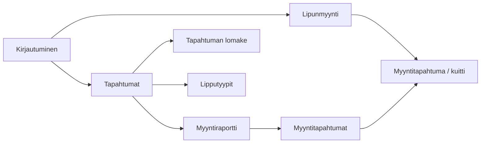

# TicketGuru-dokumentaatio

Haaga-Helia Ohjelmistoprojekti 1 · Sprint 1 (alustava)

Tämä dokumentti sisältää luvut **Johdanto**, **Järjestelmän määrittely** ja **Käyttöliittymä**. Lukuja täydennetään sprinteittäin, kun toteutus etenee.

---

## 1. Johdanto

TicketGuru on lipputoimistolle toteutettava **myyntipisteen lipunmyyntijärjestelmä**. Asiakas myy lippuja tapahtumiin kivijalkamyynnissä: asiakas ei osta lippua itse verkosta, vaan myyjä hoitaa kaupan kassalla.

Järjestelmän avulla lipputoimisto voi

- hallita tapahtumia (nimi, aika, paikka, kaupunki, lippujen enimmäismäärä)
- määritellä tapahtumakohtaiset lipputyypit ja hinnat (esim. aikuinen, lapsi, eläkeläinen)
- myydä yhden tai useamman lipun samassa myyntitapahtumassa
- tulostaa myydyt liput, joista jokaisella on yksilöllinen koodi tarkastusta varten
- tarkastella tapahtuman myyntiraporttia ja yksittäisiä myyntitapahtumia

Järjestelmää voidaan myöhemmin laajentaa verkkokaupaksi. Tämän kurssin aikana rakennetaan myyntipisteen tarvitsema ydin: Spring Boot -backend, tietokanta ja käyttöliittymä annettujen UI-luonnosten pohjalta.

### 1.1 Tavoite ja rajaus

**Tavoite:** toimiva lipunmyyntijärjestelmä, jolla myyjä voi myydä lippuja ja tapahtumakoordinaattori voi ylläpitää tapahtumia, lipputyyppejä ja seurata myyntiä.

**Rajaus (tämä kurssi):**

- Ei asiakkaan itsepalveluostosta (verkkokauppa on tulevaisuuden laajennus).
- Ei maksuliikennettä pankki- tai korttiterminaaliin; myynti kuitataan maksetuksi järjestelmässä.
- Paikkakarttaa tai istumapaikkakohtaista varausta ei toteuteta; liput ovat tyyppi- ja tapahtumakohtaisia.

### 1.2 Tekninen lähtökohta

| Osa | Valinta Sprint 1:ssä |
| --- | --- |
| Backend | Java 25 (LTS), Spring Boot 4.1, REST |
| Tietokanta kehityksessä | H2 (muistissa) |
| Tietokanta myöhemmin | PostgreSQL tai MariaDB (päätetään tiimissä) |
| Käyttöliittymä | Alustavat näkymät dokumentoitu; toteutus myöhemmässä sprintissä |
| Versionhallinta | Git + GitHub |
| Prosessi | Scrum, yhden viikon sprintit |

Lähdekoodi ja tämä dokumentaatio ovat samassa GitHub-repositoriossa.

---

## 2. Järjestelmän määrittely

Määrittely perustuu asiakkaan käyttöliittymäluonnoksiin (`docs/ui/TicketGuru-UI.pdf`) sekä lipunmyyntipisteen tyypilliseen työnkulkuun.

### 2.1 Käyttäjäroolit

Järjestelmällä on kolme varsinaista käyttäjäroolia. Lipun ostava **asiakas** ei kirjaudu järjestelmään.

#### Myyjä

Toimii kassalla asiakasrajapinnassa.

- Kirjautuu järjestelmään.
- Näkee myynnissä olevat tapahtumat.
- Valitsee tapahtuman, lipputyypit ja kappalemäärät.
- Luo myyntitapahtuman, merkitsee sen maksetuksi ja tulostaa liput.
- Voi tulostaa ennakkomyynnin jälkeen jäljellä olevat liput ovimyyntiä varten (myöhempi tarkennus).

#### Tapahtumakoordinaattori

Ylläpitää myytävää tarjontaa ja seuraa myyntiä.

- Kirjautuu järjestelmään.
- Lisää, muokkaa ja tarvittaessa peruu tapahtumia.
- Määrittelee lipputyypit ja hinnat.
- Tarkastelee myyntiraporttia (kpl ja eurot lipputyypeittäin).
- Selaa yksittäisiä myyntitapahtumia ja avaa niiden sisällön.

#### Pääkäyttäjä

Hallinnoi järjestelmän käyttäjiä ja rooleja (toteutus myöhemmin, kun kirjautuminen otetaan käyttöön).

| Rooli | Tapahtumat | Lipputyypit | Lipunmyynti | Raportit | Käyttäjät |
| --- | --- | --- | --- | --- | --- |
| Myyjä | katselu | katselu | kyllä | ei | ei |
| Tapahtumakoordinaattori | CRUD | CRUD | tarvittaessa | kyllä | ei |
| Pääkäyttäjä | kyllä | kyllä | kyllä | kyllä | kyllä |

Oikeudet tarkennetaan, kun Spring Security lisätään. Sprint 1:ssä backend on vielä avoin paikallinen REST-palvelin.

### 2.2 Käyttäjätarinat

Muoto: *Roolina haluan [toiminnon], jotta [hyöty].*  
Tunnisteet vastaavat GitHub-issuen otsikoita tuotteen työjonossa.

#### Myyjä (M)

| ID | Käyttäjätarina | Prioriteetti |
| --- | --- | --- |
| M1 | Myyjänä haluan kirjautua sisään, jotta vain valtuutetut henkilöt voivat myydä lippuja. | Korkea |
| M2 | Myyjänä haluan nähdä tulevat tapahtumat aikoineen, jotta voin tarjota asiakkaalle oikeaa tapahtumaa. | Korkea |
| M3 | Myyjänä haluan nähdä tapahtuman lipputyypit ja hinnat, jotta veloitan asiakasta oikein. | Korkea |
| M4 | Myyjänä haluan valita yhteen myyntiin useita lippuja (eri tyyppejä), jotta asiakas voi ostaa kerralla esim. kaksi aikuista ja yhden lapsen. | Korkea |
| M5 | Myyjänä haluan nähdä myynnin summan ennen vahvistusta, jotta voin kertoa hinnan asiakkaalle. | Korkea |
| M6 | Myyjänä haluan vahvistaa myynnin maksetuksi, jotta liput kirjautuvat myydyiksi. | Korkea |
| M7 | Myyjänä haluan, että jokainen lippu saa yksilöllisen koodin, jotta lippu voidaan tarkastaa ovella. | Korkea |
| M8 | Myyjänä haluan tulostaa myydyt liput, jotta voin antaa ne asiakkaalle. | Korkea |
| M9 | Myyjänä haluan nähdä, paljonko lippuja on vielä jäljellä, jotta en myy yli kapasiteetin. | Korkea |
| M10 | Myyjänä haluan avata aiemman myyntitapahtuman numerolla, jotta voin tulostaa liput uudelleen. | Keskitaso |

#### Tapahtumakoordinaattori (TK)

| ID | Käyttäjätarina | Prioriteetti |
| --- | --- | --- |
| TK1 | Tapahtumakoordinaattorina haluan kirjautua sisään, jotta voin ylläpitää tapahtumia. | Korkea |
| TK2 | Tapahtumakoordinaattorina haluan lisätä tapahtuman (nimi, aika, kaupunki, paikka, lippujen kpl), jotta se tulee myyntiin. | Korkea |
| TK3 | Tapahtumakoordinaattorina haluan muokata tapahtuman tietoja, jotta tiedot pysyvät ajan tasalla. | Korkea |
| TK4 | Tapahtumakoordinaattorina haluan listata tapahtumat, jotta näen koko tarjonnan. | Korkea |
| TK5 | Tapahtumakoordinaattorina haluan lisätä lipputyypin kuvauksen ja hinnan, jotta myyjä voi myydä eri asiakasryhmiä. | Korkea |
| TK6 | Tapahtumakoordinaattorina haluan muokata lipputyypin hintaa, jotta hinnoittelu voidaan päivittää. | Korkea |
| TK7 | Tapahtumakoordinaattorina haluan nähdä myyntiraportin lipputyypeittäin (kpl ja eurot), jotta seuraan myynnin etenemistä. | Korkea |
| TK8 | Tapahtumakoordinaattorina haluan listata tapahtuman myyntitapahtumat, jotta voin tarkistaa yksittäiset kaupat. | Keskitaso |
| TK9 | Tapahtumakoordinaattorina haluan avata myyntitapahtuman tiedot, jotta näen mitä lippuja siihen kuuluu. | Keskitaso |
| TK10 | Tapahtumakoordinaattorina haluan perua tapahtuman, jotta myynti voidaan keskeyttää esim. esiintyjän peruttua. | Matala |

#### Pääkäyttäjä (P) ja järjestelmä (J)

| ID | Käyttäjätarina | Prioriteetti |
| --- | --- | --- |
| P1 | Pääkäyttäjänä haluan luoda käyttäjätilejä ja liittää niihin roolin, jotta myyjät ja koordinaattorit pääsevät järjestelmään. | Keskitaso |
| J1 | Järjestelmänä en salli myyntiä, jos tapahtuman kapasiteetti ylittyisi, jotta ylipaikkoja ei synny. | Korkea |
| J2 | Järjestelmänä tallennan myyntitapahtumalle ajan, tunnisteen ja summan, jotta raportointi on luotettavaa. | Korkea |

### 2.3 Keskeiset käsitteet

| Käsite | Kuvaus |
| --- | --- |
| Tapahtuma | Tilaisuus, johon myydään lippuja (aika, paikka, kapasiteetti). |
| Lipputyyppi | Hinnoiteltu lippulaji, esim. Aikuinen 15,00 €. |
| Lippu | Yksittäinen myyty kappale, jolla on yksilöllinen koodi. |
| Myyntitapahtuma | Yksi kassakauppa: yksi tai useampi lippu, summa, aikaleima, juokseva numero. |
| Myyntiraportti | Kooste myydyistä lipuista lipputyypeittäin valitulle tapahtumalle. |

### 2.4 Ei-toiminnalliset vaatimukset

- Sovellus on web-sovellus; myyntipiste käyttää selainta.
- Backend tarjoaa REST-rajapinnan, jotta käyttöliittymä voidaan toteuttaa erillään.
- Jokaisen lipun koodi on yksilöllinen.
- Virheellinen syöte ei kaada palvelinta (validointi ja selkeät virheilmoitukset).
- Lähdekoodi on GitHubissa; muutokset tehdään haaroissa ja yhdistetään pull requesteilla.
- Kehitysvaiheessa tietokanta voi olla H2; tuotantokäytössä relaatietokanta.

Alustava tietomalli (luokkakaavio) piirretään, kun ensimmäiset entiteetit toteutetaan.

---

## 3. Käyttöliittymä (alustava)

Käyttöliittymä noudattaa asiakkaan luonnosta. Alla olevat näkymät ovat Sprint 1:n suunnittelun pohja; visuaalinen toteutus (värit, komponenttikirjasto) päätetään myöhemmin.

Navigointi luonnoksessa: **Lipputyypit · Raportti · Tapahtumat** sekä myyjän **Lipunmyynti**.

### 3.1 Näkymäkartta

### 3.2 Lipunmyynti

Myyjän pääsivu. Vasemmalla tai listana tulevat tapahtumat (päivä, kello, nimi). Valitulle tapahtumalle näytetään lipputyypit, kappalemääräkentät, summa ja **Myy**-painike.

Esimerkki luonnoksesta: tapahtuma *Tapahtuma A* 2.3.2020 klo 17.00; 2 × aikuinen 15,00 € ja 1 × lapsi 7,50 € → summa 37,50 €.

### 3.3 Myyntitapahtuma (kuitti)

Myynnin jälkeen näytetään myyntitapahtuman numero, rivit (tapahtuma, lipputyyppi, hinta, koodi), maksettu-aikaleima, summa ja **Tulosta liput**.

Esimerkki: myyntitapahtuma `12341234`, koodit kuten `3er454aa`.

### 3.4 Tapahtumat ja tapahtuman lomake

Tapahtumalista: aika, kaupunki, kuvaus, muokkaa. **Uusi** avaa lomakkeen: kuvaus, aika, kaupunki, paikka, lippuja kpl, tallenna.

### 3.5 Lipputyypit

Taulukko: kuvaus, hinta, muokkaa. Uusi tyyppi (esim. eläkeläinen / varusmies) lisätään kuvauksella ja hinnalla.

### 3.6 Myyntiraportti ja myyntitapahtumat

Raportti tapahtumalle: lipputyypeittäin kpl ja eurot sekä yhteensä.  
Myyntitapahtumalista: aika, numero, summa, **Näytä** avaa kuitin.

### 3.7 Roolikohtainen näkyvyys

| Näkymä | Myyjä | Tapahtumakoordinaattori |
| --- | --- | --- |
| Lipunmyynti | kyllä | valinnainen |
| Tapahtumat / lipputyypit | vain luku tai piilotettu | kyllä |
| Raportti ja myyntitapahtumat | ei | kyllä |

Kirjautumisnäkymää ei ole luonnoksessa; se lisätään, kun autentikointi toteutetaan.

### 3.8 Seuraavat tarkennukset

- Mobiili vs. kassan työpöytänäkymä
- Tulostusasettelu (lipun koko, viivakoodi/QR)
- Virhe- ja tyhjien tilojen tekstit
- Tapahtumakohtaiset vs. globaalit lipputyypit (luonnos jättää tämän auki; tiimi päättää mallin sprintissä 2)
