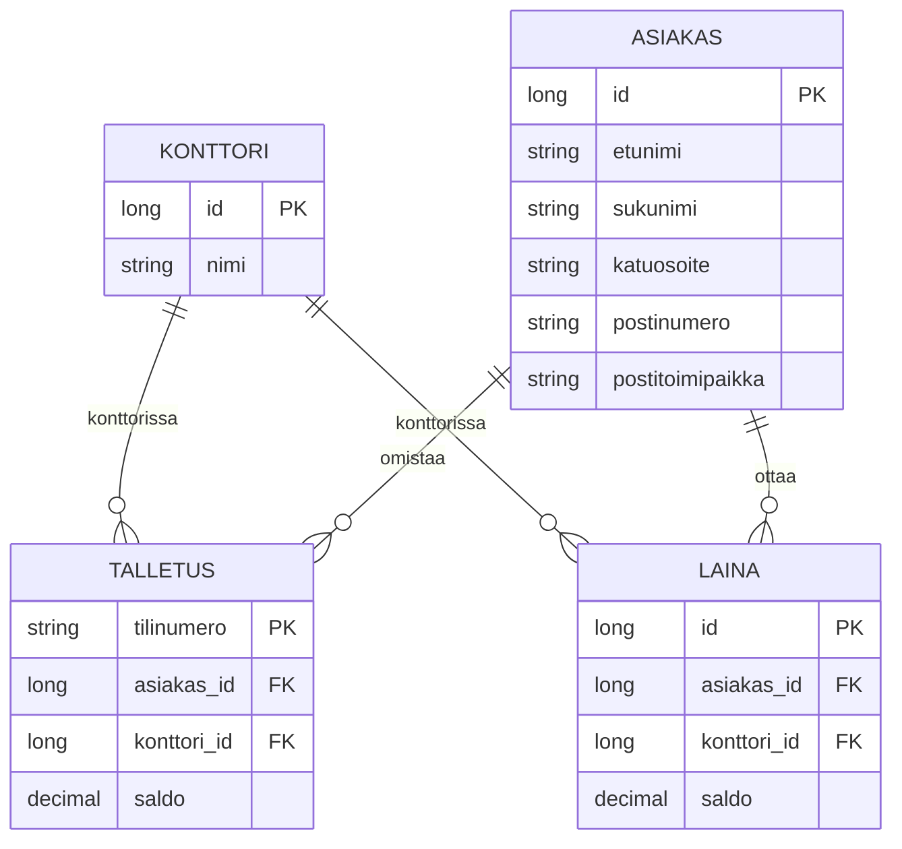

# Tietokanta Spring Boot -projektissa

Yleinen luento-ohje Ohjelmistoprojekti 1 -opiskelijoille. Tämä ei ole TicketGurun tuotedokumentaatio, vaan **miten luentojen käsiteanalyysi viedään Spring Bootin JPA-koodiksi**.

Pohjana:

- *Käsiteanalyysista tietokantarakenteeseen* (Markku Ruonavaara)
- *Tietokanta projektissa* (Markku Ruonavaara)

Esimerkit käyttävät luentojen **pankkia** (konttori, asiakas, talletus, laina), ei lipunmyyntiä. Sama kolmen vaiheen kaava toimii missä tahansa tiimiprojektissa.

Tarvitset: Spring Boot -projektin, jossa on `spring-boot-starter-data-jpa` ja tietokanta (kurssilla aluksi **H2**). Annotaatiot ovat `jakarta.persistence` (Spring Boot 3 ja 4).

---

## Mitä tehdään ja missä järjestyksessä

Asiakas ei tilaa “tietokantaa”, vaan toiminnallisuutta. Silti tietosisältö kannattaa mallintaa **heti alussa**: se tarkentaa vaatimuksia enemmän kuin pelkät käyttäjätarinat, ja se vaikuttaa arkkitehtuuriin.

```text
1. Käsiteanalyysi     →  mitä olioita, tietoja ja yhteyksiä domainissa on
2. Tietokantakaavio   →  taulut, sarakkeet, perusavaimet, vierasavaimet
3. Spring Boot        →  Entity, annotoidut suhteet, Repository
```

Spring Bootissa nämä kolme vaihetta ovat (luentokalvo *Tietokannan toteutuksen vaiheet*):

1. **Entity-luokka** = taulun olioesitys
2. **Rajoitukset ja suhteet** annotaatioilla (`@ManyToOne`, `@JoinColumn`, …)
3. **Repository-rajapinta** = DAO; Spring toteuttaa CRUD:n, omat haut JPA Query Method -nimillä

Älä aloita koodista. Jos käsitteet ovat väärin, taulut ja annotaatiot toistavat virheen.

---

## Osa A — Käsiteanalyysista tietokantaan

### A.1 Käsite vai attribuutti?

| | Käsite (entity) | Attribuutti (määre) |
| --- | --- | --- |
| Mikä se on? | Itsenäinen olio, jolla on vastine sovellusalueella | Käsitteen **osa**, yksittäinen tieto |
| Testi | Onko sillä identiteetti ilman muita tietoja? | Onko sillä merkitystä **yksinään**? |
| Tietokannassa | **Taulu** | **Sarake** |
| Esimerkki | `Asiakas`, `Konttori` | `etunimi`, `saldo` |

`etunimi` ei ole käsite. “Paavo” ilman henkilöä ei kerro mitään. `Asiakas` on käsite: sillä on nimi, osoite ja suhteita konttoreihin.

Attribuutin voi testata **esimerkkiriveillä**. Jos et keksi arvoa, se ei ole attribuutti — tai käsite on väärä.

| sukunimi | etunimi | katuosoite | postinumero | postitoimipaikka |
| --- | --- | --- | --- | --- |
| Koistinen | Paavo | Rautatieläisenkatu 5 | 00520 | Helsinki |
| Puupponen | Timo | Mannerheimintie 30 | 00100 | Helsinki |

Saldot (`talletussaldo`, `lainasaldo`) näyttävät attribuuteilta, mutta **kenen**? Pelkkä `Asiakas.talletussaldo` ei riitä, jos asiakas voi olla usealla konttorilla. Saldo kuuluu asiakkaan ja konttorin **suhteeseen**.

### A.2 Miten käsitteet, attribuutit ja yhteydet löytyvät?

Vaatimustekstistä:

- **substantiivit** → kandidaatteja käsitteiksi tai attribuuteiksi
- **verbit** → yhteyksiä käsitteiden välillä
- **lukumäärät** (“useita”, “yhteen”, “voi olla”) → 1:1, 1:N, N:M ja pakollisuus

Luentoesimerkki:

> Pankissa on useita konttoreita. Asiakas voi tehdä pankkikonttoriin talletuksia ja/tai lainata rahaa. Asiakkaalle ylläpidetään talletussaldoa ja/tai lainasaldoa. Asiakas voi olla asiakkaana useammalla pankkikonttorilla.

Tästä seuraa:

| Lause | Mallinnus |
| --- | --- |
| Pankissa on **useita** konttoreita | 1:N (pankki → konttori) |
| Asiakas **voi** tallettaa / lainata | yhteys on **valinnainen** |
| Asiakas **useammalla** konttorilla, konttorilla **monta** asiakasta | **N:M** |

Yhtä ainoaa oikeaa mallia ei ole. Mallia testataan vaatimuksiin: onko kaikki tarvittava tieto, vastaako malli tarinoita.

### A.3 Yhteystyypit relaatiotietokannassa

#### Yhden suhde moneen (1:N)

*Henkilö kuuluu yhteen osastoon. Osastoon voi kuulua monta henkilöä.*

Vierasavain (FK) laitetaan **N-puolelle**: henkilön riviin `osasto_id`, joka viittaa osaston perusavaimeen (PK).

| osasto_id (PK) | nimi |
| --- | --- |
| 1 | Myynti |
| 2 | Varasto |

| henkilo_id (PK) | nimi | osasto_id (FK) |
| --- | --- | --- |
| 1 | Paavo Koistinen | 2 |
| 2 | Timo Puupponen | 1 |
| 3 | Liisa Taavila | 1 |

Jos yhteys on **valinnainen** (“henkilön ei tarvitse kuulua osastoon”), FK saa arvon `NULL`. Osastolla ei tarvitse olla yhtään henkilöä.

#### Monta moneen (N:M)

Vierasavainta ei voi laittaa molempiin tauluihin yhtä aikaa. Lisäksi attribuutti (esim. saldo) ei voi kuulua “yhteyteen”: relaatiotietokannassa **vain käsitteellä** (taululla) on sarakkeita.

Siksi N:M **puretaan kahdeksi 1:N-suhteeksi** lisäkäsitteellä. Luennossa `Talletus` ja `Laina`:

- asiakkaalla voi olla monta talletusta
- talletus liittyy **aina yhteen** asiakkaaseen ja **yhteen** konttoriin
- `saldo` ja `tilinumero` ovat talletuksen attribuutteja, eivät asiakkaan

Sama idea lainoille.



### A.4 Sarakkeiden tyypit

Kun taulut, PK:t ja FK:t ovat selvillä, sarakkeille annetaan tyypit.

Esimerkki luennolta, taulu `Talletus`:

| Attribuutti | Tyyppi | Arvojoukko | Kuvaus |
| --- | --- | --- | --- |
| Tilinumero PK | `VARCHAR(14)` | merkit 0–9 | tilin IBAN-tunniste |
| Asiakasid FK | `INTEGER` | Asiakas-viittaus | tilin haltija |
| Konttoriid FK | `INTEGER` | Konttori-viittaus | konttori, jossa tili on |
| Saldo | `NUMERIC(10,2)` | desimaali | saldo sentin tarkkuudella |

Yleisiä SQL-tyyppejä: `INTEGER`, `DECIMAL(n,m)`, `VARCHAR(n)`, `CHAR(n)`, `DATETIME`, `BLOB`. Javassa `DECIMAL` → `BigDecimal` (älä käytä `double` rahalle).

Kaavionotaatioita on useita (crow’s foot, Chen, UML-luokkakaavio). Periaate on sama: käsitteet, attribuutit, lukumäärät, pakollisuus.

---

## Osa B — ORM, DAO ja Spring Boot

### B.1 ORM, JPA ja Hibernate

**ORM** (Object-Relational Mapping) tekee relaatiotaulusta olioita. Sovellus ei kirjoita SQL:ää joka hakuun, vaan käyttää Java-olioita. Hibernate hoitaa SQL:n.

| Kerros | Rooli |
| --- | --- |
| **JPA** (Jakarta Persistence API) | Rajapinta: `@Entity`, `@Id`, `EntityManager`, … |
| **Hibernate** | JPA-toteutus, Spring Bootin oletus |
| **Spring Data JPA** | Repositoryt, query methodit, transaktiot |

Spring Frameworkin ORM-luku: Spring integroi JPA/Hibernaten transaktioihin ja DAO-poikkeuksiin. Kurssiprojektissa et konfiguroi `EntityManagerFactoryä` käsin — `spring-boot-starter-data-jpa` riittää.

### B.2 DAO-malli vs Repository

[DAO-malli](https://www.baeldung.com/java-dao-pattern) erottaa **sovelluslogiikan** ja **tallennuksen**. Sovellus kutsuu `save`, `find`, `delete` — se ei tiedä, onko takana H2, PostgreSQL vai lista muistissa.

Perinteinen DAO:

```java
public interface Dao<T> {
    Optional<T> get(long id);
    List<T> getAll();
    void save(T t);
    void update(T t);
    void delete(T t);
}
```

Ilman Springiä kirjoittaisit `JpaUserDao`-luokan, joka kutsuu `entityManager.find(...)`, `persist`, `merge`. Spring Bootissa **Repository on DAO**:

- rajapinta, ei omaa luokkaa
- Spring generoi toteutuksen käynnistyessä
- CRUD tulee `JpaRepository`:sta valmiina
- omat haut metodin nimellä (query methods)

Controller tai palvelu riippuu repositorystä, ei SQL:stä. Tietokannan vaihto (H2 → PostgreSQL) ei muuta Entity-luokkia, jos tyypit ovat kannettavia.

---

## Osa C — Kolme vaihetta koodissa

Sijoitus:

```text
src/main/java/.../domain/        ← Entity-luokat
src/main/java/.../repository/    ← Repository-rajapinnat
```

`application.properties` (H2, kuten kurssin aloituksessa):

```properties
spring.datasource.url=jdbc:h2:mem:pankki
spring.datasource.username=sa
spring.datasource.password=
spring.jpa.hibernate.ddl-auto=update
spring.jpa.show-sql=true
spring.h2.console.enabled=true
spring.h2.console.path=/h2-console
```

`ddl-auto=update` luo/päivittää taulut Entityistä. Kehityksessä ok; tuotannossa käytetään myöhemmin migraatioita (Flyway/Liquibase).

### Vaihe 1 — Entity-luokka

Yksi luokka = yksi taulu. Pakolliset: `@Entity`, `@Id`.

```java
package fi.haagahelia.esimerkki.domain;

import jakarta.persistence.Entity;
import jakarta.persistence.GeneratedValue;
import jakarta.persistence.GenerationType;
import jakarta.persistence.Id;

@Entity
public class Konttori {

    @Id
    @GeneratedValue(strategy = GenerationType.AUTO)
    private Long id;

    private String nimi;

    public Konttori() {} // JPA vaatii parametrittoman konstruktorin

    public Konttori(String nimi) {
        this.nimi = nimi;
    }

    public Long getId() { return id; }
    public String getNimi() { return nimi; }
    public void setNimi(String nimi) { this.nimi = nimi; }
}
```

| Annotaatio | Merkitys |
| --- | --- |
| `@Entity` | tämä luokka on taulun olioesitys |
| `@Id` | perusavain |
| `@GeneratedValue` | kanta luo id:n |
| `@Table(name = "konttori")` | taulun nimi, jos ei luokan nimeä |
| `@Column(nullable = false, length = 100)` | sarakkeen rajoitus |

Asiakas samalla kaavalla: kentät `etunimi`, `sukunimi`, `katuosoite`, `postinumero`, `postitoimipaikka`.

### Vaihe 2 — Rajoitukset ja suhteet

Luento: suhteet merkitään **annotaatioin** (1:N, N:M, …).

**1:N** (osasto ← henkilö). Vierasavain N-puolella, `@ManyToOne` + `@JoinColumn`:

```java
package fi.haagahelia.esimerkki.domain;

import jakarta.persistence.Entity;
import jakarta.persistence.GeneratedValue;
import jakarta.persistence.GenerationType;
import jakarta.persistence.Id;
import jakarta.persistence.JoinColumn;
import jakarta.persistence.ManyToOne;

@Entity
public class Henkilo {

    @Id
    @GeneratedValue(strategy = GenerationType.AUTO)
    private Long id;

    private String nimi;

    @ManyToOne
    @JoinColumn(name = "osasto_id") // FK-sarake henkilön taulussa
    private Osasto osasto;

    public Henkilo() {}

    public Henkilo(String nimi, Osasto osasto) {
        this.nimi = nimi;
        this.osasto = osasto;
    }

    public Long getId() { return id; }
    public String getNimi() { return nimi; }
    public void setNimi(String nimi) { this.nimi = nimi; }
    public Osasto getOsasto() { return osasto; }
    public void setOsasto(Osasto osasto) { this.osasto = osasto; }
}
```

Valinnainen yhteys (luentokalvo: `osasto_id` voi olla `NULL`):

```java
@ManyToOne
@JoinColumn(name = "osasto_id", nullable = true)
private Osasto osasto;
```

Pakollinen yhteys: `nullable = false`.

Osastolta henkilöihin (kokoelma, ei FK-saraketta osastotauluun):

```java
@OneToMany(mappedBy = "osasto")
private List<Henkilo> henkilot = new ArrayList<>();
```

`mappedBy = "osasto"` = “FK on jo `Henkilo.osasto`-kentässä”. Ilman sitä Hibernate yrittäisi luoda turhan liitostaulun.

**N:M lisäkäsitteenä** (talletus). Älä käytä `@ManyToMany`, jos yhteydellä on attribuutteja (`saldo`, `tilinumero`):

```java
package fi.haagahelia.esimerkki.domain;

import java.math.BigDecimal;

import jakarta.persistence.Column;
import jakarta.persistence.Entity;
import jakarta.persistence.Id;
import jakarta.persistence.JoinColumn;
import jakarta.persistence.ManyToOne;

@Entity
public class Talletus {

    @Id
    @Column(length = 14)
    private String tilinumero;

    @ManyToOne(optional = false)
    @JoinColumn(name = "asiakas_id", nullable = false)
    private Asiakas asiakas;

    @ManyToOne(optional = false)
    @JoinColumn(name = "konttori_id", nullable = false)
    private Konttori konttori;

    @Column(precision = 10, scale = 2, nullable = false)
    private BigDecimal saldo;

    public Talletus() {}

    public Talletus(String tilinumero, Asiakas asiakas, Konttori konttori, BigDecimal saldo) {
        this.tilinumero = tilinumero;
        this.asiakas = asiakas;
        this.konttori = konttori;
        this.saldo = saldo;
    }

    public String getTilinumero() { return tilinumero; }
    public Asiakas getAsiakas() { return asiakas; }
    public void setAsiakas(Asiakas asiakas) { this.asiakas = asiakas; }
    public Konttori getKonttori() { return konttori; }
    public void setKonttori(Konttori konttori) { this.konttori = konttori; }
    public BigDecimal getSaldo() { return saldo; }
    public void setSaldo(BigDecimal saldo) { this.saldo = saldo; }
}
```

`Laina` samoin: kaksi `@ManyToOne`-kenttää (`asiakas`, `konttori`) + `saldo`. Lainalle luennossa ei ole IBAN-avainta, joten `@Id @GeneratedValue Long id` riittää.

### Vaihe 3 — Repository-rajapinta

```java
package fi.haagahelia.esimerkki.repository;

import java.util.List;

import org.springframework.data.jpa.repository.JpaRepository;

import fi.haagahelia.esimerkki.domain.Asiakas;
import fi.haagahelia.esimerkki.domain.Talletus;

public interface TalletusRepository extends JpaRepository<Talletus, String> {

    List<Talletus> findByAsiakas(Asiakas asiakas);

    List<Talletus> findByKonttoriId(Long konttoriId);

    List<Talletus> findBySaldoGreaterThan(java.math.BigDecimal raja);
}
```

`JpaRepository<Talletus, String>`: ensimmäinen tyyppi on Entity, toinen **perusavaimen Java-tyyppi** (`String` koska `tilinumero`, `Long` jos juokseva id).

Valmiina ilman omaa koodia mm.:

| Metodi | Mitä tekee |
| --- | --- |
| `save(entity)` | insert tai update |
| `findById(id)` | haku PK:lla, palauttaa `Optional` |
| `findAll()` | kaikki rivit |
| `deleteById(id)` | poisto |
| `count()` | rivimäärä |

Käyttö palvelussa tai `CommandLineRunnerissa`:

```java
Konttori k = konttoriRepository.save(new Konttori("Kallio"));
Asiakas a = asiakasRepository.save(new Asiakas("Paavo", "Koistinen",
        "Rautatieläisenkatu 5", "00520", "Helsinki"));
talletusRepository.save(new Talletus("FI211234560000", a, k, new BigDecimal("1500.00")));

List<Talletus> paavonTilit = talletusRepository.findByAsiakas(a);
```

Tallenna ensin `Konttori` ja `Asiakas`, sitten `Talletus`. Muuten FK viittaa riviin, jota ei ole.

---

## Osa D — JPA Query Methods

Spring lukee metodin nimen ja rakentaa JPQL:n. Sääntö:

```text
findBy + Attribuutti + [Ehto] + [And/Or + Attribuutti + Ehto] + [OrderBy + Attribuutti + Asc/Desc]
```

Attribuutti on Entity-kentän nimi (`sukunimi`, ei SQL-sarakkeen nimi).

```java
public interface AsiakasRepository extends JpaRepository<Asiakas, Long> {

    List<Asiakas> findBySukunimi(String sukunimi);

    List<Asiakas> findBySukunimiAndEtunimi(String sukunimi, String etunimi);

    List<Asiakas> findByPostitoimipaikka(String postitoimipaikka);

    List<Asiakas> findBySukunimiContainingIgnoreCase(String osa);

    List<Asiakas> findBySukunimiOrderByEtunimiAsc(String sukunimi);
}
```

`findBySukunimiAndEtunimi` ≈ `SELECT a FROM Asiakas a WHERE a.sukunimi = ?1 AND a.etunimi = ?2`.

Sisäkkäinen polku (talletuksen konttorin id): `findByKonttoriId` lukee `talletus.konttori.id`.

### Hyödyllisiä avainsanoja

| Metodin pätkä | JPQL-ehto | Esimerkki |
| --- | --- | --- |
| `findByX` | `x = ?` | `findBySukunimi` |
| `And` / `Or` | `AND` / `OR` | `findBySukunimiAndEtunimi` |
| `IgnoreCase` | `UPPER(...)` | `findBySukunimiIgnoreCase` |
| `Containing` | `LIKE %?%` | `findByNimiContaining` |
| `StartingWith` | `LIKE ?%` | `findByNimiStartingWith` |
| `GreaterThan` | `>` | `findBySaldoGreaterThan` |
| `LessThan` / `LessThanEqual` | `<` / `<=` | `findBySaldoLessThan` |
| `Between` | `BETWEEN` | `findBySaldoBetween` |
| `IsNull` / `IsNotNull` | `IS NULL` | `findByOsastoIsNull` |
| `True` / `False` | `= true/false` | `findByAktiivinenTrue` |
| `OrderByXDesc` | `ORDER BY` | `findByKonttoriIdOrderBySaldoDesc` |
| `In` | `IN` | `findByIdIn(List<Long> ids)` |

Palautustyyppi: `List<T>`, `Optional<T>` (0–1 riviä), `T` (varo `null`), tai `Page<T>` sivutukseen.

Jos nimi ei riitä, kirjoita kysely itse:

```java
import org.springframework.data.jpa.repository.Query;
import org.springframework.data.repository.query.Param;

@Query("SELECT t FROM Talletus t WHERE t.konttori.nimi = :nimi AND t.saldo > :raja")
List<Talletus> haeKonttorinSuuretTilit(@Param("nimi") String nimi,
                                       @Param("raja") BigDecimal raja);
```

Virheellinen metodinimi kaataa **sovelluksen käynnistyksen** (ei vasta ensimmäistä kutsua). Lue stack tracesta “No property … found”.

Virallinen taulukko: [JPA Query Methods](https://docs.spring.io/spring-data/jpa/reference/jpa/query-methods.html).

---

## Osa E — Miten tarkistat, että taulut syntyivät

1. Käynnistä sovellus (`./mvnw spring-boot:run`).
2. Konsoliin tulostuu `create table ...` (`show-sql=true`).
3. Avaa http://localhost:8080/h2-console  
   JDBC URL sama kuin `spring.datasource.url` (esim. `jdbc:h2:mem:pankki`), käyttäjä `sa`, salasana tyhjä.
4. `SELECT * FROM TALLETUS;` — H2 muuttaa nimet usein ISOIKSI.

Jos taulua ei ole: Entity ei ole komponenttiskannauksen paketissa (saman juuripaketin alla kuin `@SpringBootApplication`) tai luokasta puuttuu `@Entity`.

---

## Osa F — Tyypilliset virheet

| Oire | Syy | Korjaus |
| --- | --- | --- |
| `No identifier specified` | `@Id` puuttuu | lisää perusavain |
| `No property X found for type Y` | query methodin kentän nimi väärin | käytä Java-kenttää (`sukunimi`, ei `sukunimi_id`) |
| `could not execute statement` / FK | lapsi tallennettu ennen vanhempaa | `save` konttori ja asiakas ensin |
| N:M liitostaulu ilman saldoa | `@ManyToMany` vaikka yhteydellä on dataa | tee välikäsite (`Talletus`) ja kaksi `@ManyToOne` |
| `double` rahalle | pyöristysvirheet | `BigDecimal` + `precision/scale` |
| Taulu ei synny | väärä paketti | Entity samaan hierarkiaan kuin applikaatioluokka |
| `osasto_id` ei saa olla tyhjä | `nullable = false` vaikka luento salli NULL | `nullable = true` valinnaiselle 1:N:lle |

---

## Osa G — Siirto omaan projektiin (muistilista)

1. Kirjoita vaatimuksista substantiivit ja verbit. Erota käsite ja attribuutti.
2. Piirrä 1:N ja N:M. Jos yhteydellä on saldo, päivämäärä tai tila → välikäsite, ei `@ManyToMany`.
3. Nimeä PK:t ja FK:t, valitse saraketyypit.
4. Yksi Entity / taulu, suhteet annotaatioin.
5. Yksi `JpaRepository` / Entity. Lisää vain ne `findBy…`-metodit, joita tarinat tarvitsevat.
6. Testaa H2-konsolilla ja pienellä `CommandLineRunnerilla` tai testeillä.

TicketGurussa sama kaava (ei tämän ohjeen koodia): tapahtuma, lipputyyppi, myynti, lippu. Lippu kuuluu myyntiin ja lipputyyppiin — se on välikäsite, jolla on oma koodi, kuten talletuksella on tilinumero ja saldo.

---

## Lähteet

Kurssimateriaali:

- Markku Ruonavaara, *Käsiteanalyysista tietokantarakenteeseen*
- Markku Ruonavaara, *Tietokanta projektissa*

Luentokalvojen lähteet:

- [Spring Framework: Object-Relational Mapping (ORM) Data Access](https://docs.spring.io/spring-framework/reference/data-access/orm.html)
- [The DAO Pattern in Java (Baeldung)](https://www.baeldung.com/java-dao-pattern)
- [Spring Data JPA: Query Methods](https://docs.spring.io/spring-data/jpa/reference/jpa/query-methods.html)

Lisäksi:

- [Crow’s foot -notaatio (Vertabelo)](https://www.vertabelo.com/blog/crow-s-foot-notation/)
- [Chen ERD -notaatio (Vertabelo)](https://www.vertabelo.com/blog/chen-erd-notation/)
